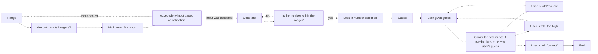

### Node Descriptions

**Range**: The computer verifies that the range is valid. If the maximum of the range is less than the minimum of the range, the input is accepted. Else, an error is given, and the user is prompted to give a new valid range. This continues until the computer is given a valid range. 
* Checks if the inputs are integers
* Checks that the range minimum is less than the range maximum. 
* Accept/Deny - If the input does not meet conditions, user is prompted to give a new valid range. If the input does meet conditions, we advance to *Generate*.

**Generate**: The computer selects a random number within the specified range. 
* It must check that the number it has generated is in the range. If not, it must generate a new number. If so, we advance to *Guess*. 

**Guess**: The user guesses the number, and the computer responds whether the guess is too high, too low, or correct. If the guess is two high or two low, the user has the opportunity to give a new guess. If the guess is correct, we advance to *End*. 

**End**: The process ends. 